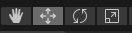
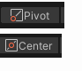
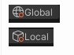
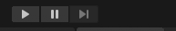
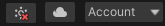
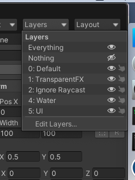
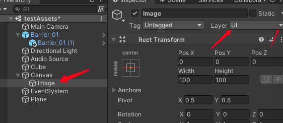

# Unity工具栏按钮介绍

* 小手工具 快捷键(Q) 选中之后可以点击鼠标左键平移Scene场景 <鼠标按下中键也可以快捷的切换到这个工具,松开会还原到原来的工具>
* 四个箭头工具 快捷键(W) 选中之后点击物体，物体会出现红绿蓝三个箭头,点击箭头拖动，可以在该箭头的方向移动物体，(其中红绿蓝分别队形XYZ轴正方向)
**另外中间会有一个小正方体,鼠标移动过去会发现也有三个颜色的面(红绿蓝)，选中某个面可以进行移动，比如选中红色的面,代表移动和X轴相交的面即Y-Z面,移动的时候只有Y/Z两个坐标会发生变化**

* 两个箭头缠绕的工具  快捷键(E) 选中之后点击物体，物体会出来三个环绕的圆环，左键单击某个圆环然后拖动可以让物体沿着圆环垂直的方向(比如红色代表绕X周旋转)旋转。三条颜色的线(红绿蓝分别对应XYZ，旋转红色则对应绕着X方向的旋转)
* 方框内一个正方形一个箭头的工具 快捷键(R) 这是一个对3D物体进行缩放的工具,选中之后，点击物体会出现三个方向的小正方形，选中可以在该方向上缩放物体,三个小正方形的颜色(红绿蓝分别对应XYZ方向的缩放)
  

* Pivot 模式下，会显示模型的坐标原点,这个点使用来计算模型所在位置的点。比如模型放在(100,100,100) 这个点，那就意味着Pivot的模型的点要移动到这个位置,类似于cocos的锚点。
* Center 是指模型的中心点，包括所有的子模型一起计算，类似于cocos计算某个结点以及该结点下所有的子物体加起来所围成的矩形的中心,只不过这里是长方体的中心

(Control/Command)+D 复制模型 Mac下是command+d,win下是control+d

对于某些有数字的地方，鼠标左键单击数字的标题左右拖动可以调整数值

* Global 模式下,物体的坐标轴始终显示全局坐标轴，旋转物体的时候坐标轴不会发生变化
* Local 模式下，物体的坐标轴始终显示物体的坐标轴,旋转的时候坐标轴跟着旋转发生变化
**总结：跟cocos的世界坐标和本地坐标一样,显示的坐标轴是用来方便观察,只不过cocos的坐标都是2D的，这里显示的是3D的**

* 三角形按钮表示运行项目,再点击就是取消运行
* 两个竖线代表暂停,即暂停游戏，再点击就是继续运行
* 一个三角形加一个竖线代表逐帧运行

* Account 是我们的账号
* 另外两个是和云端有关的服务[TODO] 回头继续补充

* Layers 显示了在场景上的各个级别的层，层上有个眼睛和小手,眼睛可以控制层的显示和隐藏,小手可以锁定该层。比如我们拖动一个模型或者一个3D物体的话，层默认是在Default上，拖动一个2D UI,那么默认是在UI层上，当然这个默认值是可以修改的
* Everything 选项是控制所有层的，点击眼睛让所有层显示
* Nothing 跟Evenrything一样，只不过是控制所有层隐藏，两个是互斥的关系
* 点击EditLayers 可以在里面添加新的层或者删除自定义层(内置的层是无法编辑的)

