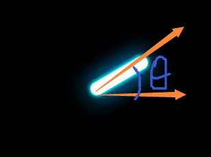

# 复习线性代数
1. 向量点乘
	公式: a * b = ||a|| * ||b|| * cos(Θ) = ax * bx + ay * by + az * bz
	1. 根据cos(Θ)的曲线，可以知道在(-90~90)之间为正数,(90~270)之间为负数
	应用:
		计算两个向量的夹角
		例如:摇杆的旋转方向,可以算出摇杆中心位置到手指触摸点的向量和摇杆沿着X轴方向的向量求出Θ角,
		但是因为余弦值在第二象限和第三象限 或者第一象限和第四象限中存在相同的值,所以需要使用其他的点积来区分
		
		所以可以利用cos曲线的特性,计算摇杆中心位置到手指触摸点的向量和沿Y轴正方向的向量点乘的积,
		如果大于等于0,说明此时摇杆中心位置到手指触摸点的向量在第二象限Θ角不变,反之处于第三象限,此时应为角度应为(360-Θ)
        同理可以用沿Y轴负方向的向量来区分第一和第四象限
        ```lua
            self._pointer = cc.Sprite:create("em_line.png")
            self._pointer:setAnchorPoint(cc.p(0,0.5))
            self:addChild(self._pointer)
            self._pointer:setPosition(cc.p(display.cx,display.cy))


            local centerPoint = cc.p(display.cx,display.cy)
            --从中心点向右1个单位的向量
            local rightVector = cc.p(1,0)
            local topVector = cc.p(0,1)
            local bottomVector = cc.p(0,-1)
            local processFunc = function(touch) 
                --从中心点到点击点的向量
                local clickPos = touch:getLocation()
                local clickVector = cc.pSub(clickPos,centerPoint)


                --求出两个向量的夹角
                --根据向量点乘公式 a * b = ||a|| * ||b|| * cos(Θ) = ax * bx + ay * by + az * bz
                local cosA = cc.pDot(cc.pNormalize(clickVector),rightVector)
                local A = math.acos(cosA)
                --根据cos(Θ)的曲线，可以知道在(-90~90)之间为正数,(90~270)之间为负数
                --如果向量与垂直向上的向量余弦值小于0,说明在第二或者第三象限
                A = (A/math.pi) * 180
                --区分第二象限和第三象限
                if cosA < 0 then
                    print("cosA < 0")
                    --注意此时的角度无法区分是否在第二象限或者第三象限
                    --那么可以让中心到点击点的向量跟垂直向量求点积,如果为正,说明在第二象限,否则为第三象限
                    --处于第三象限的话角度应该为360-Θ
                    local cosB = cc.pDot(cc.pNormalize(clickVector),topVector)
                    if cosB < 0 then
                        A = 360 - A
                    end
                else
                    --区分第一象限和第四象限
                    --如果是第四象限  用360-A
                    local cosB = cc.pDot(cc.pNormalize(clickVector),bottomVector)
                    if cosB > 0 then
                        A = 360 - A
                    end
                end

                --因为cocos顺时针旋转的,所以这里需要用360 - A
                A = 360 - A
                self._pointer:setRotation(360-A)
            end


            
            local function onNodeTouchBegan(touch, event)
                processFunc(touch)
                return true
            end

            local function onNodeTouchMoved(touch, event)
                processFunc(touch)
            end


            local listener = cc.EventListenerTouchOneByOne:create()
            listener:setSwallowTouches(true)
            listener:registerScriptHandler(onNodeTouchBegan, cc.Handler.EVENT_TOUCH_BEGAN)
            listener:registerScriptHandler(onNodeTouchMoved, cc.Handler.EVENT_TOUCH_MOVED)
            local eventDispatcher = self:getEventDispatcher()
            eventDispatcher:addEventListenerWithSceneGraphPriority(listener, self)
        ```
  
2. 向量的叉乘
	公式: a × b = [
					ax * bx,
				  	ay * by,
				  	az* bz
				  ]
	向量的叉乘求出来的是一个向量,这个向量垂直于a,b所在的平面，根据右手定则可以判断该向量的方向。
	右手四指从a向量绕向b向量,大拇指所指的方向就是该向量的方向。
	根据右手定则，我们可以判断出以下几点
	1. 假设求出来的向量为c,如果a在b的右边,那么c在(a,b,c)组成的坐标系中，方向为正,否则为负

	应用:
		计算某个点P是否在多边形内部(假设知道了多边形的所有的点)，将所有的点按顺时针方向组成一个一个的
		向量,通过判断多边形点到P的向量 和多边形边的向量 的叉乘是否大于0(是否在右边)来判断是否处于多边形内部。


